<div align="center">

# Simulations on Packed Beds

### Synthetic bed generation · image-based porosity analysis · CFD of foam & packed beds

**Dual Degree (B.Tech + M.Tech) Project · Department of Chemical Engineering, IIT Delhi**

*Utkarsh Singh · Advisor: Prof. Vivek V. Buwa · 2020 – 2022*


-green)

</div>

---

<table>
<tr>
<td width="50%">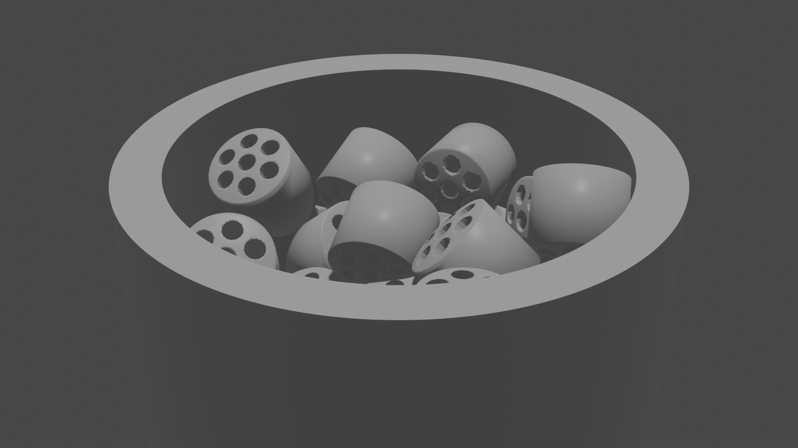</td>
<td width="50%">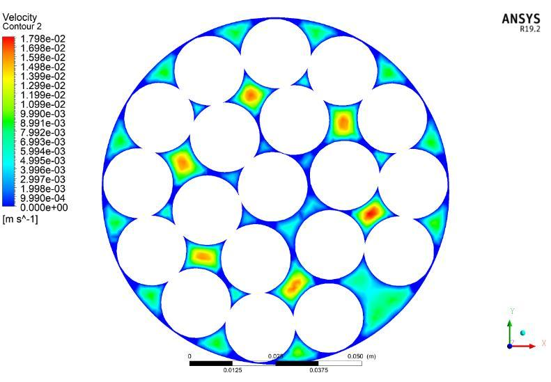</td>
</tr>
<tr>
<td align="center"><em>A packed bed of 7-hole catalyst pellets, generated from scratch in Blender</em></td>
<td align="center"><em>Simulated flow through the resulting bed in Ansys Fluent</em></td>
</tr>
</table>

## What is this?

Packed-bed reactors are everywhere in the chemical industry — methanol synthesis,
steam–methane reforming, ammonia synthesis. Their performance (pressure drop, heat
transfer, catalyst effectiveness) is governed by **how the catalyst particles pack
together** and by the **shape of the particles** themselves.

Before you can simulate flow and heat transfer in such a reactor, you need a
realistic 3-D model of the bed. The usual route — build a physical bed and painstakingly
reconstruct its packing in CAD — is slow and hard to reproduce.

**This project takes a different route:** it *grows* the bed computationally. Catalyst
particles are dropped into a virtual tube inside **Blender**, and its rigid-body physics
engine settles them into a realistic random packing. The bed is then characterised and
simulated:

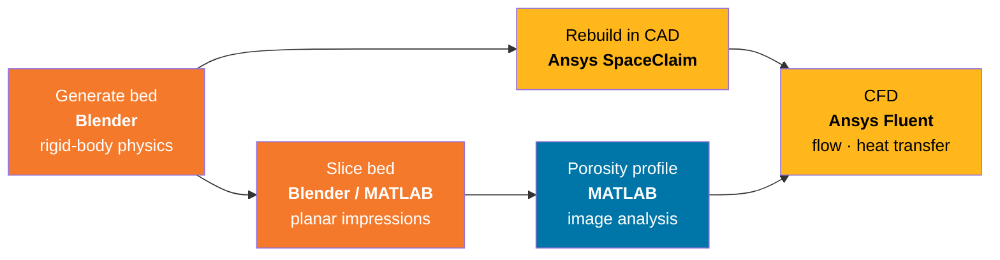

The work spans three semesters and builds toward a single thesis:

| Phase | Focus | Deliverable |
|:-----:|-------|-------------|
| **I** | Synthetic bed generation + image-based porosity analysis | [Report ›](reports/1_synthetic-bed-generation-and-porosity-analysis.pdf) |
| **II** | CFD of catalytic **foam beds** (Kelvin-cell & spherical-particle foams) | [Report ›](reports/2_simulations-of-foam-beds.pdf) |
| **III** | Heat transfer in **packed beds**; effect of contact-surface geometry | [Thesis ›](reports/3_thesis_simulations-on-packed-beds.pdf) |

---

## Phase I — Growing a bed and measuring its porosity

### 1. Generate the packing (Blender)

A cylindrical tube is created as a passive rigid body with its top open. Catalyst
particles are then released **one at a time** — each is keyframed as a *kinematic*
body until its release frame, then flips to *dynamic* and falls under gravity,
colliding and settling into place. A high-quality solver (1500 substeps/s, 200
solver iterations) keeps the thin, low-restitution contacts stable so the final
packing is physically realistic.

Nine catalyst shapes were modelled, several of them industrially relevant
multi-lobe and holed pellets:

<div align="center">
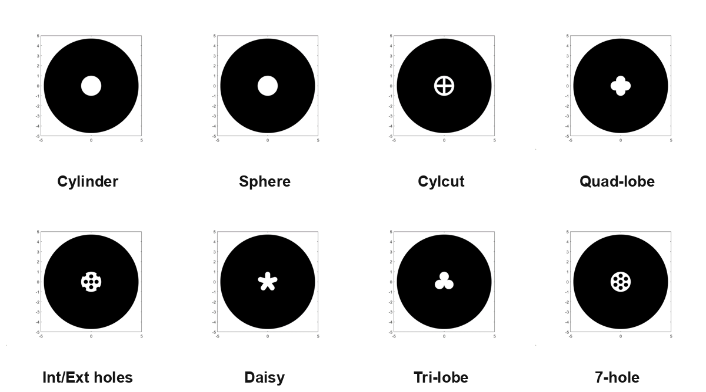
<br><em>Planar cross-sections of the nine particle shapes — the white outline is the
particle's impression on a slice through the bed.</em>
</div>

The lobed pellets are generated **parametrically**: for an `N`-lobe pellet, the
cross-section is `N` overlapping circles of radius `R` whose centres sit a distance
`d` from the axis. The visible arc swept by each lobe is

$$\text{arc angle} = \pi + \frac{2\pi}{N} - 2\arccos\!\left(\frac{d\,\sin(\pi/N)}{R}\right)$$

The profile is meshed, capped, and extruded — see
[`02_nlobe_particle.py`](code/blender/02_nlobe_particle.py).

<div align="center">

<br><em>A settled synthetic bed, viewed down the tube axis.</em>
</div>

### 2. Slice the bed and measure porosity (MATLAB)

To get the **radial porosity profile** — how void fraction varies from the tube wall
to its centre — the bed is sliced into a stack of horizontal planes. Two methods were
built:

- **Analytic projection (MATLAB):** each particle shape's outline on a plane is derived
  from first principles (a cylinder projects to an ellipse, a sphere to a circle, etc.)
  and drawn per-shape.
- **Universal Boolean slicing (Blender):** the plane is cut by every particle it
  intersects using a Boolean-difference modifier, then rendered. This works for
  *any* geometry with one script — no per-shape math required
  ([`05_export_planar_slices.py`](code/blender/05_export_planar_slices.py)).

Each slice is binarised; at every radius `r` the void fraction is the ratio of black
(void) to total pixels, averaged over all planes to give the *z*-averaged radial
porosity ([`avgRadialPorosity.m`](code/matlab/avgRadialPorosity.m)).

<table>
<tr>
<td width="40%">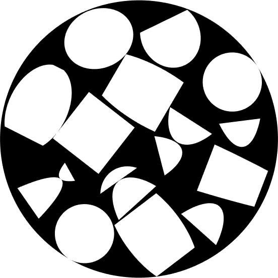</td>
<td width="60%">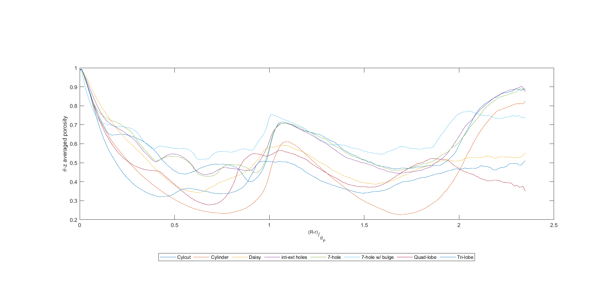</td>
</tr>
<tr>
<td align="center"><em>A binarised slice: void (black) vs. solid (white).</em></td>
<td align="center"><em>z-averaged radial porosity vs. dimensionless wall distance <code>(R−r)/d<sub>p</sub></code>, compared across particle shapes.</em></td>
</tr>
</table>

> **Result:** particles with internal and external holes reach a **higher void fraction**
> than solid shapes such as cylinders and daisy pellets — a direct handle on pressure
> drop and transport in the bed.

---

## Phase II — Flow through catalytic foam beds

Catalytic **foams** offer very high specific surface area. Two foam geometries were
built and simulated in Ansys Fluent.

### Kelvin-cell foam

The foam skeleton is modelled on **Lord Kelvin's 1887 problem** — *what equal-volume
cells fill space with the least surface area?* His answer, the bitruncated cubic
honeycomb (a lattice of tetrakaidecahedra), is used as the foam unit cell. The struts
are cylindrical (Ø 3.38 mm, cell Ø 16.8 mm).

<table>
<tr>
<td width="25%">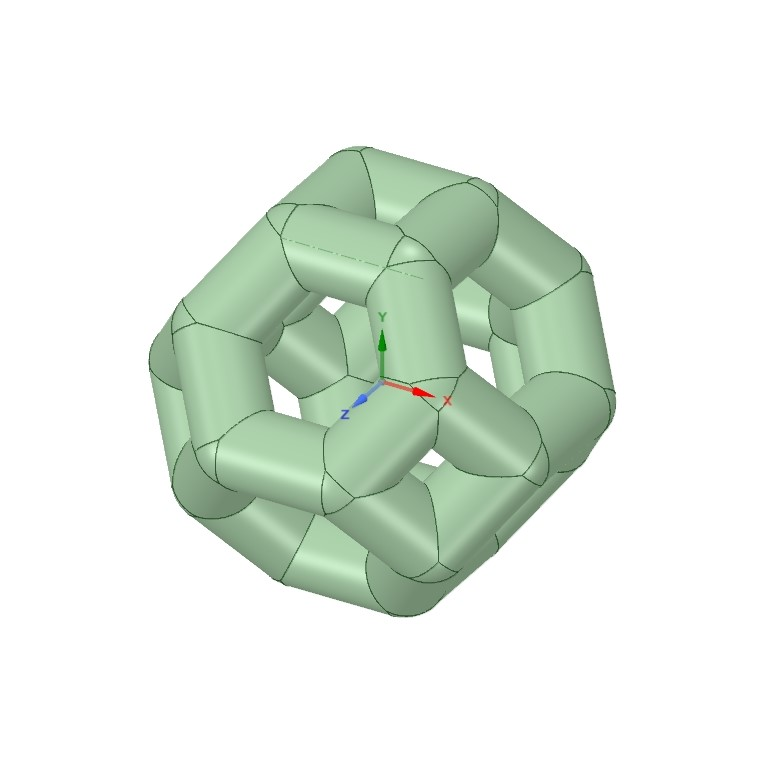</td>
<td width="25%">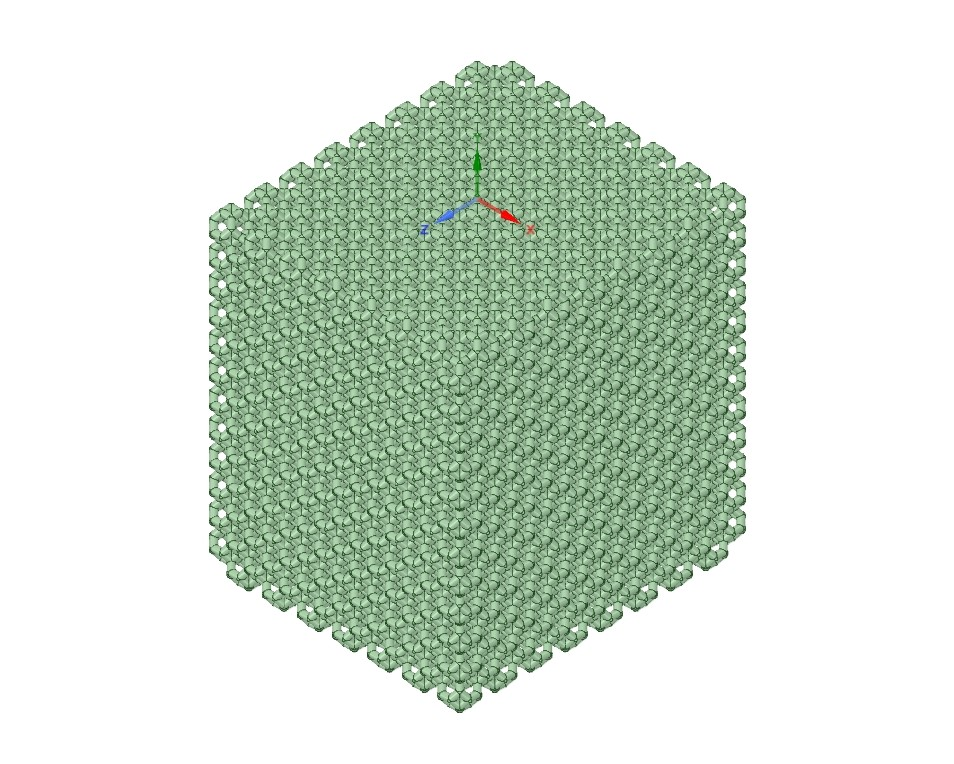</td>
<td width="25%">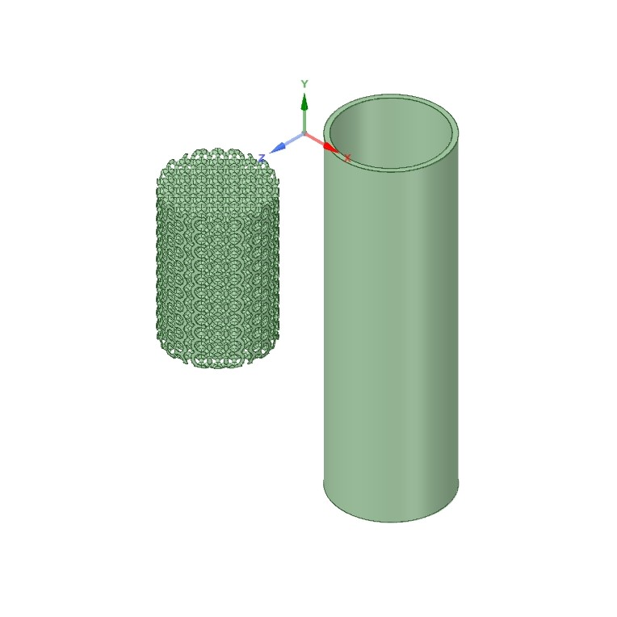</td>
<td width="25%">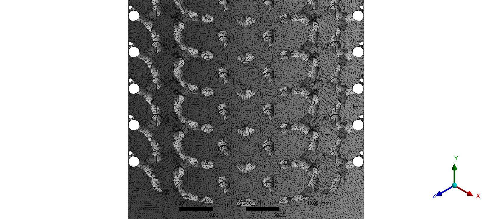</td>
</tr>
<tr>
<td align="center"><em>Unit cell</em></td>
<td align="center"><em>3-D lattice</em></td>
<td align="center"><em>Foam bed</em></td>
<td align="center"><em>~9M-element mesh</em></td>
</tr>
</table>

Turbulent flow (Re ≈ 50 000) was solved with **three RANS turbulence models** — standard
*k*–ε, *k*–ω, and SST *k*–ω — to compare their pressure and velocity fields. The RANS
closure averages the Navier–Stokes equations and models the turbulent stresses via the
Boussinesq hypothesis, differing in how the eddy viscosity $\mu_t$ is computed. SST *k*–ω
blends *k*–ω near the wall with *k*–ε in the bulk:

$$\mu_t = \frac{a_1\rho k}{\max(a_1\omega,\; S F_2)}$$

<table>
<tr>
<td width="50%">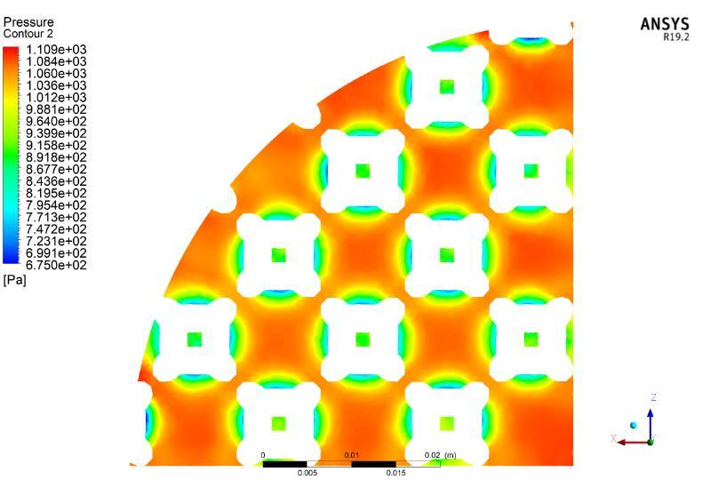</td>
<td width="50%">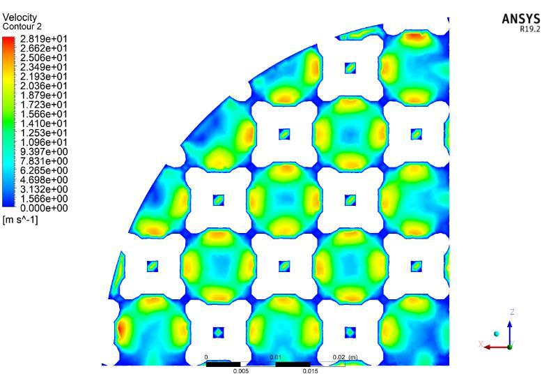</td>
</tr>
<tr>
<td align="center"><em>Pressure field across the foam cross-section</em></td>
<td align="center"><em>Velocity field across the foam cross-section</em></td>
</tr>
</table>

### Spherical-particle foam

A synthetically generated sphere packing is converted into a foam by **expanding each
particle's volume** (by 1 %, 5 % and 10 %) until neighbours merge into a connected
solid. Laminar flow (Re ≈ 10) and heat transfer were then simulated, and the radial
porosity of the three expansions compared.

<div align="center">
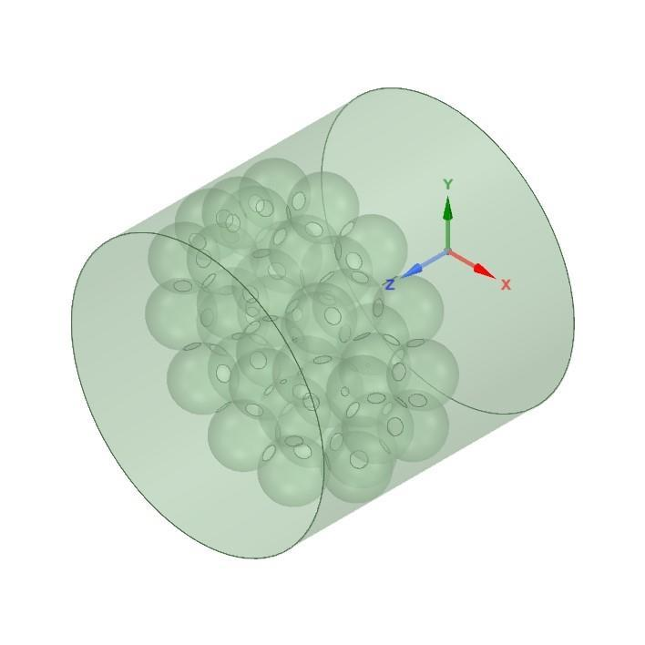
&nbsp;&nbsp;

<br><em>Left: spherical-particle foam geometry. Right: velocity field, showing jetting through the pore throats.</em>
</div>

---

## Phase III — Heat transfer in packed beds

The final thesis phase studies **conjugate heat transfer** in a spherical-particle
packed bed heated by a sandwich of hot gas, and asks a focused question: *does the
shape of the surface separating the hot and cold fluid regions matter?*

Two beds were built — identical packings differing only in the **fluid–fluid contact
surface**: one **planar**, one **zig-zag corrugated**. Both were rebuilt from the
Blender packing in SpaceClaim (via [`recreate_bed_in_spaceclaim.py`](code/ansys/recreate_bed_in_spaceclaim.py)),
meshed with a poly-hexcore scheme, and solved in Fluent with a particle heat sink of
50 kW/m³.

<table>
<tr>
<td width="34%">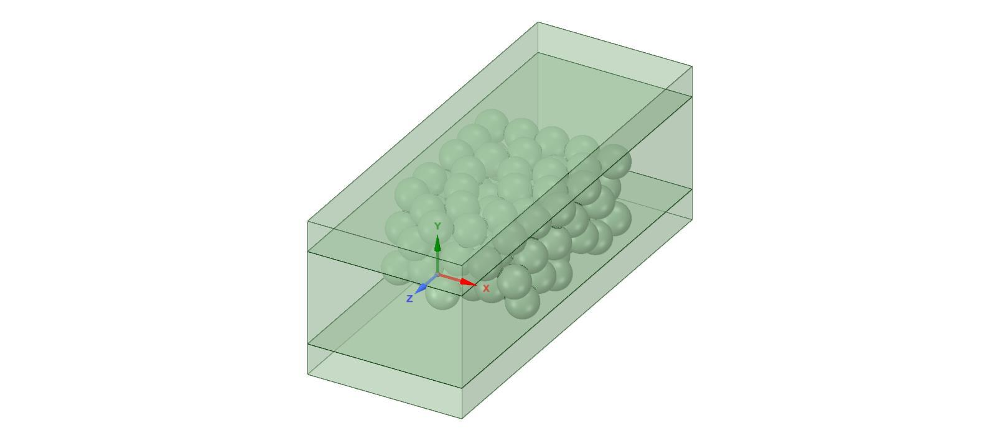</td>
<td width="33%">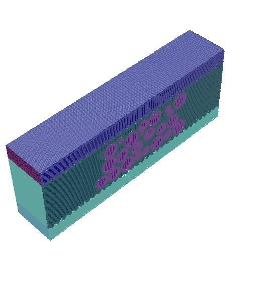</td>
<td width="33%">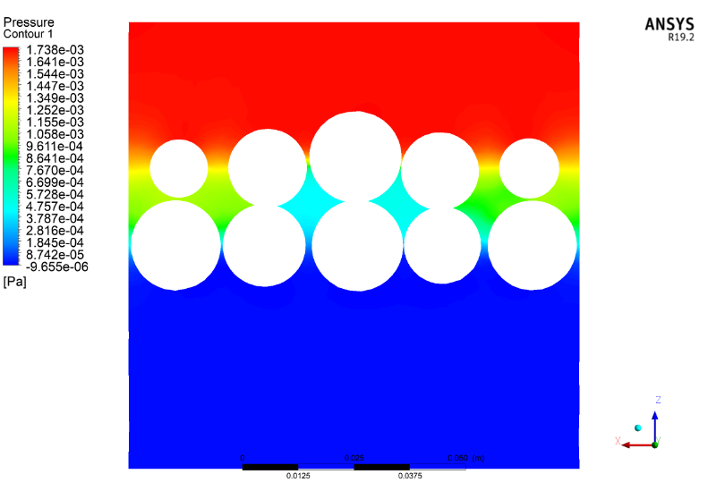</td>
</tr>
<tr>
<td align="center"><em>Bed rebuilt in Ansys SpaceClaim</em></td>
<td align="center"><em>Poly-hexcore mesh</em></td>
<td align="center"><em>Temperature field through the bed</em></td>
</tr>
</table>

A full surface-by-surface heat balance was computed for both configurations, quantifying
how the corrugated contact surface redistributes heat between the streams.

---

## Repository structure

```
packed-bed-simulations/
├── reports/            # 3 finalised PDF reports  (Phase I, II, III / thesis)
├── presentations/      # 3 final presentation decks
├── code/
│   ├── blender/        # bed generation, parametric particles, slicing, export (Python)
│   ├── ansys/          # SpaceClaim script to rebuild a packing as CAD
│   ├── matlab/         # image-based porosity analysis + plotting
│   └── python/         # pixel-discretisation study (Jupyter)
├── blender-files/      # the actual .blend project files + particle-shape library
├── data/               # a sample settled bed: particle locations + porosity profile
└── assets/gallery/     # figures used throughout this README
```

## Reproducing the pipeline

1. **Generate a bed** — open [`blender-files/bed-generation_physics.blend`](blender-files),
   or run [`code/blender/01_generate_packed_bed.py`](code/blender/01_generate_packed_bed.py)
   in Blender's Scripting workspace; bake the rigid-body cache.
2. **Export the packing** — [`03_export_particle_transforms.py`](code/blender/03_export_particle_transforms.py)
   writes `particleLoc.csv` (see [`data/sample-sphere-bed/`](data/sample-sphere-bed) for the format).
3. **Slice + measure porosity** — [`05_export_planar_slices.py`](code/blender/05_export_planar_slices.py)
   renders the slices; [`code/matlab/avgRadialPorosity.m`](code/matlab/avgRadialPorosity.m) turns them
   into a radial porosity profile.
4. **CFD** — rebuild the packing in SpaceClaim with
   [`code/ansys/recreate_bed_in_spaceclaim.py`](code/ansys/recreate_bed_in_spaceclaim.py), then mesh and
   solve in Fluent.

## Tech stack

| Tool | Role |
|------|------|
| **Blender** (Python / `bpy`) | Rigid-body bed generation, parametric particle modelling, universal Boolean slicing |
| **MATLAB** | Image binarisation & radial-porosity extraction, analytic particle projections, plotting |
| **Ansys SpaceClaim** (Python) | Scripted CAD reconstruction of the exact packing |
| **Ansys Fluent** | RANS turbulent & laminar CFD, conjugate heat transfer |
| **Python / Jupyter** | Pixel-discretisation error analysis for the porosity method |

---

## About

This repository collects the finalised deliverables of my Dual Degree (B.Tech + M.Tech)
project at the **Department of Chemical Engineering, IIT Delhi**, carried out under
**Prof. Vivek V. Buwa**. It brings together an open-source physics-based approach to
synthetic packed-bed generation, an image-processing pipeline for porosity
characterisation, and CFD studies of foam and packed beds.

**Acknowledgments:** Prof. Vivek V. Buwa (supervisor), Mr. Kuldeep Singh, and the
examining committee — Prof. Jyoti Phirani, Prof. Manjesh Kumar, Prof. Shantanu Roy and
Prof. Vikram Singh.

### License & use

- **Code** (`code/`, Blender/Ansys scripts) is released under the [MIT License](LICENSE).
- **Reports, presentations, figures and `.blend` files** are academic work shared for
  reference; please cite this repository / the thesis if you build on them.
- Third-party journal PDFs from the original literature review are **not** redistributed
  here for copyright reasons; see the reference lists inside each report.
